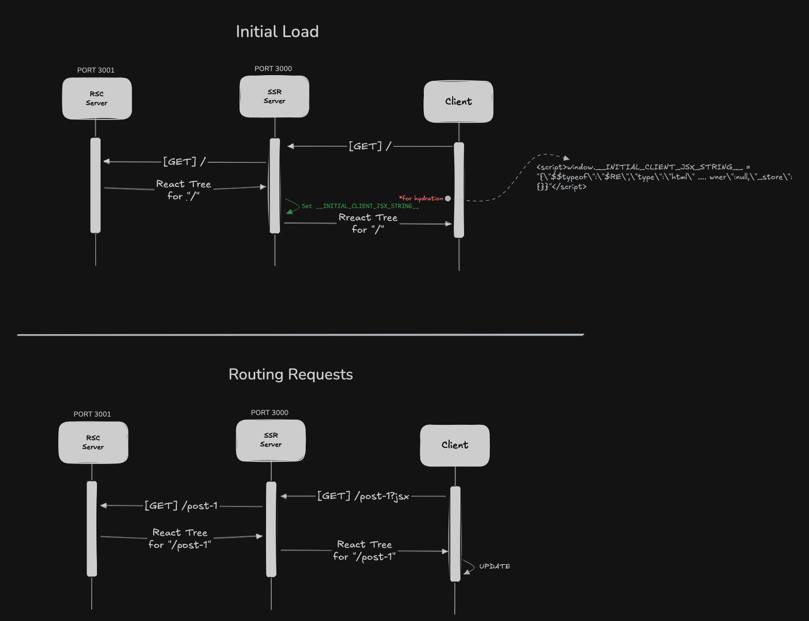

# React Server Component from Scratch

## with React

- [client.js](client.js)
- [rsc.js](./server/rsc.js)
- [ssr.js](./server/ssr.js)

## Start

To run this example:

- `npm install` or `yarn`
- `npm run start` or `yarn start`

## How React Server and Client communicate

## Challenges

- [x] Add a random background color to the <body> of the page, and add a transition on the background color. When you navigate between the pages, you should see the background color animating.
- [x] Implement support for fragments (`<>`) in the RSC renderer. This should only take a couple of lines of code, but you need to figure out where to place them and what they should do.
- [x] Once you do that, change the blog to format the blog posts as Markdown using the `<Markdown>` component from `react-markdown`. Yes, our existing code should be able to handle that!
- [x] The `react-markdown` component supports specifying custom implementations for different tags. For example, you can make your own Image component and pass it as `<Markdown components={{ img: Image }}>`. Write an `Image` component that measures the image dimensions (you can use some npm package for that) and automatically emits width and height.
- [x] Add a comment section to each blog post. Keep comments stored in a JSON file on the disk. You will need to use `<form>` to submit the comments. As an extra challenge, extend the logic in `client.js` to intercept form submissions and prevent reloading the page. Instead, after the form submits, refetch the page JSX so that the comment list updates in-place.
- [x] Pressing the Back button currently always refetches fresh JSX. Change the logic in `client.js` so that Back/Forward navigation reuses previously cached responses, but clicking a link always fetches a fresh response. This would ensure that pressing Back and Forward always feels instant, similar to how the browser treats full-page navigations.
- [x] When you navigate between two different blog posts, their entire JSX gets diffed. But this doesn't always make sense — conceptually, these are two different posts. For example, if you start typing a comment on one of them, but then press a link, you don't want that comment to be preserved just because the input is in the same location. Can you think of a way to solve this? (Hint: You might want to teach the `Router` component to treat different pages with different URLs as different components by wrapping the `{page}` with something. Then you'd need to ensure this "something" doesn't get lost over the wire.)
- [ ] The format to which we serialize JSX is currently very repetitive. Do you have any ideas on how to make it more compact? You can check a production-ready RSC framework like Next.js App Router, or our [official non-framework RSC demo](https://github.com/reactjs/server-components-demo) for inspiration. Even without implementing streaming, it would be nice to at least represent the JSX elements in a more compact way.
- [ ] Imagine you wanted to add support for Client Components to this code. How would you do it? Where would you start?
